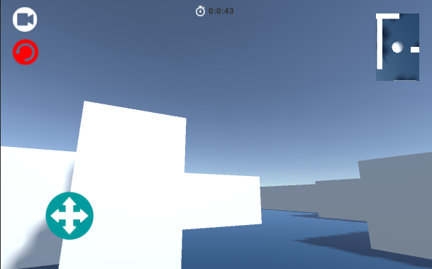
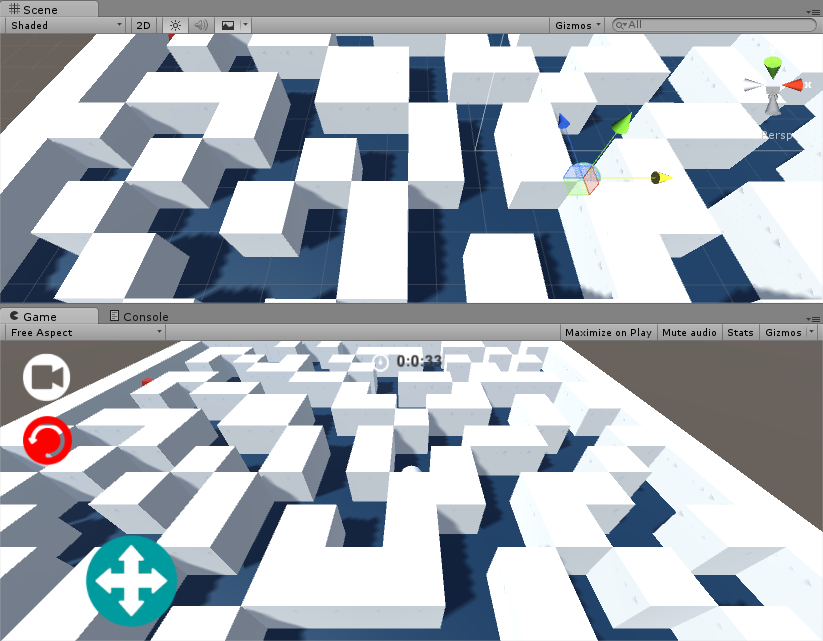

# 迷宫游戏
为完成某司“出入江湖”副本任务，自学[Unity](http://unity3d.com/)，两周时间内开发的3D小游戏。（Deadline是第一生产力。。。）

## 下载地址

* 工程下载：
* 安卓APK：

## 实现功能
Unity版本：5.3.2
编程语言：C#
Android版本：2.3.1+

* 游戏流程UI：开始界面、暂停界面、通关界面
* 视角控制：第一人称、第三人称切换，小地图显示
* 主角控制：触控虚拟摇杆控制，第一人称下右侧屏幕触屏角度控制
* 地图生成：地图随机产生，规模随关卡增加增大。（生成算法有待改进。。。）

## 效果展示

